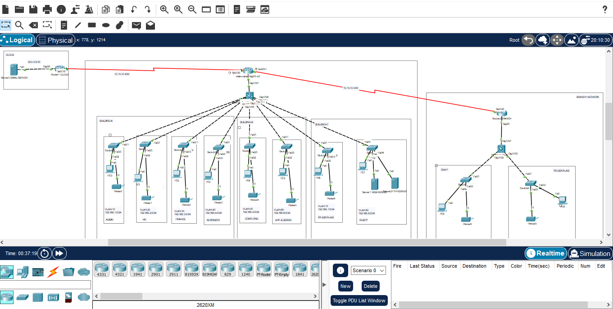

# University Network Design & Implementation

# Project Overview

This project is a complete network design and simulation for **University**, which has **two campuses** located 20 miles apart. The goal was to build a secure, scalable, and reliable network using **Cisco Packet Tracer**, meeting specific functional and architectural requirements across multiple buildings and departments.

---

## Network Structure

### **Main Campus**
- **Building A**: Administrative Staff (Management, HR, Finance) + Faculty of Business  
  → Uses VLANs for each department. PCs acquire IPs via **router-based DHCP**.
  
- **Building B**: Faculty of Engineering/Computing + Art & Design  
  → Uses RIPv2 routing.
  
- **Building C**: Students’ Labs + IT Department  
  → Hosts internal servers: **Web Server, File Server, etc.**

### **Smaller Campus**
- Faculty of Health and Sciences  
  → Staff and students are on separate floors and VLANs.

### **External Cloud**
- Email Server hosted on the cloud  
  → Accessible via **Static Routing**.

---

## Objectives Achieved

- Designed a real-world enterprise university network with multiple buildings and campuses.
- Configured VLANs to segment traffic across departments and faculties.
- Implemented **RIPv2** for dynamic routing between internal routers.
- Used **Static Routing** for cloud-based external email server.
- Implemented **DHCP** for dynamic IP assignment.
- Enabled server access across VLANs and campuses.

---

## Technologies Used

| Component            | Configuration Used                      |
|----------------------|------------------------------------------|
| **Simulation Tool**  | Cisco Packet Tracer                      |
| **Routing Protocol** | RIPv2 + Static Routing                   |
| **IP Addressing**    | Class C Subnets for Each Department      |
| **VLANs**            | Per Department/Faculty                   |
| **DHCP**             | Router-based DHCP                        |
| **Servers**          | Internal Web Server, External Email Server |

---

## Network Topology

_Visual representation of the entire network: Main and Small campuses, building-wise setup, VLANs, routers, and external server._

---

## How to Test / Run

1. Open the `University_Network.pkt` file using Cisco Packet Tracer.
2. Verify:
   - DHCP IP assignment in Buildings
   - Server access from different VLANs
   - Inter-building and inter-campus connectivity via RIPv2
   - External email server access through static route
3. Use ping and web requests to test server reachability and VLAN isolation.
---

## Key Learnings

- How to design and implement VLAN-based segmentation for departments.
- How to configure inter-VLAN routing and RIPv2 for real-world networks.
- How to use DHCP in a router environment.
- Network planning for scalability, reliability, and performance.

---

## Performance & Security Highlights

- **Performance**: Subnetting and VLANs reduce broadcast domain size.
- **Scalability**: Easy to add more faculties or buildings using RIPv2 and VLANs.
- **Reliability**: Redundant links and structured design prevent single point failure.
- **Security**: Basic port security on switches and isolated VLANs.

---

## License
This project is for academic and learning purposes only.

